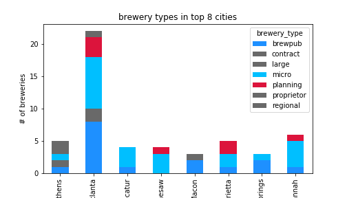
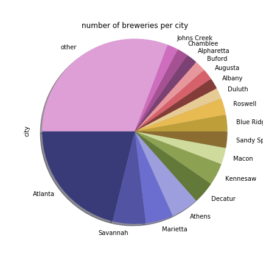
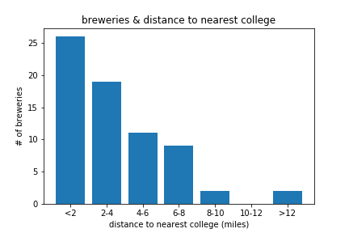

# Summary of Findings

## Which type of brewery is the most popular in Georgia?

We found that _small production breweries_ (microbreweries and brewpubs) are the most popular type of brewery.
Other types of breweries include large, proprietor, contract, and regional breweries.
Our dataset also contained breweries in planning stages, which are also most likely going to be small production breweries as well.

**Figure 1: Number of each type of brewery in Georgia.** Small production breweries (microbreweries and brewpubs) formed the majority. Breweries in planning, upon subjective review, were mostly microbreweries or brewpubs as well.

**Figure 2: Types of breweries in the 8 cities with the highest number of breweries.** Small production breweries (in lighter blue colors) are shown to form the majority in each city, consistent with quantitative findings. Breweries in planning (in red) are also highlighted.

## How are breweries dispersed in Georgia?

The city with the most breweries was unsurprisingly _Atlanta_.
Breweries were more likely to be located in the metro Atlanta area, as well as other more well-known cities in Georgia such as Savannah and Athens.

**Figure 3: Number of breweries per each city in relation to total breweries in Georgia.** Cities with only one brewery were categorized as "other". Atlanta visually holds the largest portion as compared to other cities.

**Figure 4: Heatmap of brewery coordinates in Georgia.** A redder color represents a higher density of breweries in the area, as opposed to a greener color. Again, the area surrounding Atlanta shows the highest concentration of breweries.

## Is there a relationship between craft brewery location and college campuses?

We chose this question to explore the relationship between craft breweries and the younger adult (approx. ages 18-30) demographic. We found that on average, a craft brewery was _3.56 miles_ away from the nearest college campus. The median distance was _2.95 miles_, suggesting a _right skew_ in the data.

**Figure 5: Number of breweries per distance category to nearest college.** Breweries were categorized by distance and plotted by frequency. The highest number of breweries fell in the 0 to 2 mile range. Visually, the graph also confirms our analysis of a right skew.

**Figure 6: Marker layer depicting college campuses added on top of heatmap from Figure 4.** This shows the relation of brewery concentration and nearby colleges accordingly.

## What’s the relationship between brewery location and population demographics?

Review of population size against brewery location suggests that population density alone is not the strongest determining factor in brewery location.  There are several criteria that impact placement including the emerging economy, the emerging population (current and anticipated demographics), retail environment, etc.  Additional factors to be explored include the area's socioeconomic makeup, age demographics and zoning.

**Figure 7: Total population of 9 most populous zip codes.** Data was pulled from the 2018 US Census.

# Conclusion
Overall, we found that small production breweries largely formed the majority of all breweries in Georgia, likely moreso in the last decade due to their trending popularity. More breweries were located in the metro Atlanta region than anywhere else. They were also, on average, only 3.56 miles away from the nearest college campus. Deeper analysis and dissection of population and demographic data are needed to establish significant correlations.
